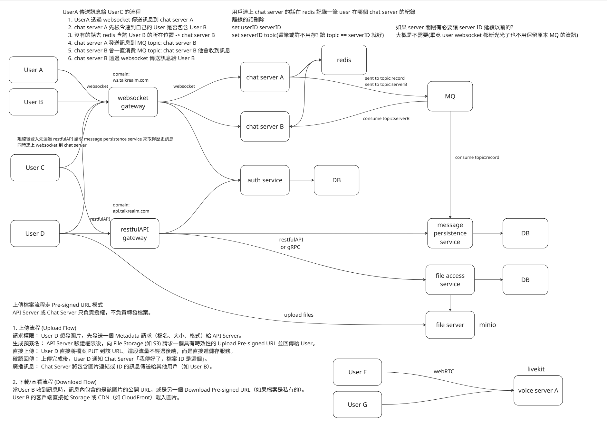
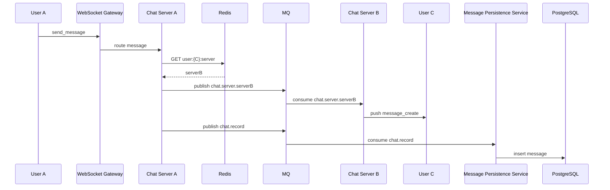

# TalkRealm Architecture（Current Design）

> 更新日期：2026-04-30  
> 本文件描述「目前採用的目標架構設計」：以強化版 monolith 為短期落地，並依 `plan.md` 漸進拆分為微服務。

## 架構設計總覽圖



## 1) 架構總覽

```mermaid
graph TB
    subgraph Client[Client (Web / App)]
        C1[Web Client]
        C2[Mobile App]
    end

    subgraph Edge[Edge]
        WSGW[WebSocket Gateway<br/>ws.talkrealm.com]
        APIGW[RESTfulAPI Gateway<br/>api.talkrealm.com]
    end

    subgraph Realtime[Realtime Layer]
        CSA[Chat Server A]
        CSB[Chat Server B]
        Redis[(Redis)]
        MQ[(NATS JetStream / Kafka)]
    end

    subgraph Core[Core Services]
        AUTH[Auth Service]
        MSGP[Message Persistence Service]
        FILE[File Access Service]
        LIVEKIT[LiveKit Voice Server]
    end

    subgraph Storage[Storage]
        PG[(PostgreSQL)]
        MINIO[(MinIO / S3 Compatible)]
    end

    C1 -->|wss| WSGW
    C2 -->|wss| WSGW
    C1 -->|https| APIGW
    C2 -->|https| APIGW

    WSGW --> CSA
    WSGW --> CSB

    CSA --> Redis
    CSB --> Redis
    CSA --> MQ
    CSB --> MQ

    MQ -->|chat.record| MSGP
    MSGP --> PG

    APIGW --> AUTH
    AUTH --> PG

    APIGW --> FILE
    FILE --> PG
    FILE --> MINIO

    C1 -->|WebRTC| LIVEKIT
    C2 -->|WebRTC| LIVEKIT
```

## 2) 服務職責

| 服務 | 主要職責 |
|---|---|
| WebSocket Gateway | 維護長連線、將 WS 流量路由到 Chat Server |
| Chat Server | 即時訊息處理、跨節點訊息轉發、presence/typing 事件 |
| RESTfulAPI Gateway | 統一 REST 入口與服務轉發 |
| Auth Service | 註冊/登入/JWT 驗證 |
| Message Persistence Service | 消費 `chat.record`，非同步寫入訊息 DB |
| File Access Service | 產生 pre-signed URL、檔案 metadata 管理 |
| LiveKit Voice Server | 語音/視訊（WebRTC） |
| Redis | `user -> server` 映射、online 狀態、rate limit |
| MQ (NATS JetStream) | 跨 Chat Server 路由與事件解耦 |

## 3) 核心流程

### 3.1 跨 Server 訊息（User A -> User C）



### 3.2 連線狀態（Redis）

- 連線：`SET user:{userID}:server {serverID} EX 86400`
- 斷線：`DEL user:{userID}:server`
- Guild 在線集合：`SADD/SREM guild:{guildID}:online {userID}`

### 3.3 檔案上傳（Pre-signed URL）

1. Client 呼叫 `POST /api/v1/files/presign`
2. File Access Service 產生 MinIO 上傳 URL（短時效）
3. Client 直接 PUT 到 MinIO
4. Client 透過 WS 發送 `type=file` + `file_id`
5. 接收方以 `GET /api/v1/files/{id}/url` 取得下載 URL

### 3.4 語音頻道（LiveKit）

1. Client 呼叫 `GET /api/v1/channels/{id}/voice/token`
2. 後端驗權後簽發 LiveKit token
3. Client 以 token 連線 LiveKit（WebRTC）

## 4) WebSocket 協議（現行設計）

### Client -> Server op

- `identify`
- `heartbeat`
- `send_message`
- `subscribe_channel`
- `unsubscribe_channel`
- `typing_start`
- `voice_state_update`

### Server -> Client op

- `hello`
- `heartbeat_ack`
- `ready`
- `message_create`
- `message_update`
- `message_delete`
- `typing_start`
- `presence_update`
- `channel_create`
- `channel_update`
- `channel_delete`
- `error`

### 訊息封包格式

```json
{
  "op": "send_message",
  "d": {
    "channel_id": 1,
    "content": "Hello",
    "type": "text",
    "file_id": null
  },
  "nonce": "client-uuid"
}
```

## 5) Topic 與資料模型重點

### MQ Topics

- `chat.server.{serverID}`：跨 Chat Server 路由
- `chat.record`：訊息持久化
- `chat.event`：其他事件廣播（通知等）

### 關鍵資料表（摘要）

- `users`
- `guilds`
- `guild_members`
- `guild_invites`（新增）
- `channels`
- `messages`（含 `is_edited`, `deleted_at`）
- `message_attachments`（新增）
- `files`（新增）

## 6) 目前落地策略（Migration Path）

1. **Phase 1（短期）**：強化 monolith（WS 協議與 channel 訂閱優化、presence/typing、RBAC、cursor pagination）
2. **Phase 2（中期）**：接入 MQ，拆出 WS Gateway / API Server binary
3. **Phase 3（中期）**：File Service + MinIO，Voice（LiveKit）
4. **Phase 4（長期）**：完整微服務拆分與獨立部署

## 7) 技術選型

| 需求 | 主選 | 備選 |
|---|---|---|
| Message Queue | NATS JetStream | Kafka |
| Object Storage | MinIO | AWS S3 |
| Voice | LiveKit | mediasoup |
| API Gateway | Nginx / Custom Go | Kong |
| Metrics / Tracing | Prometheus + Grafana / OpenTelemetry | - |
