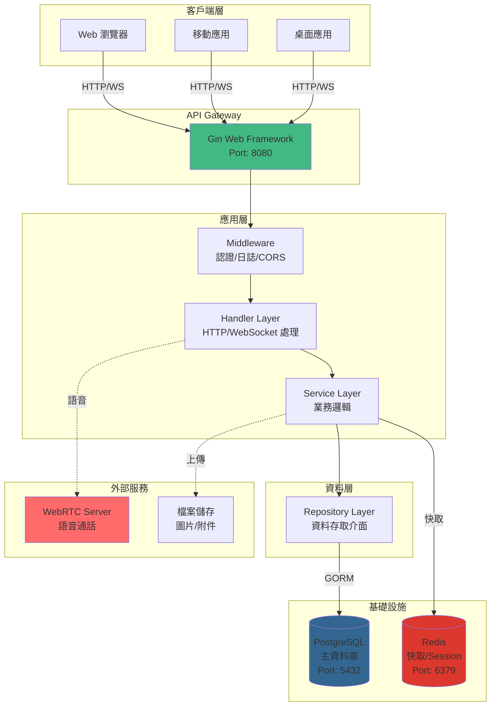
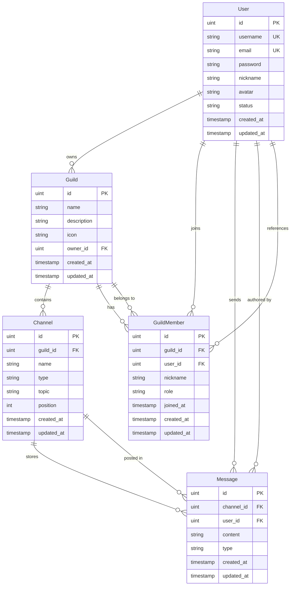
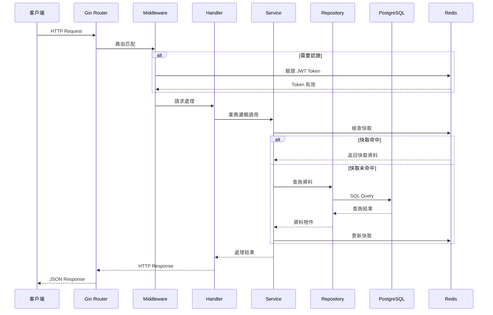
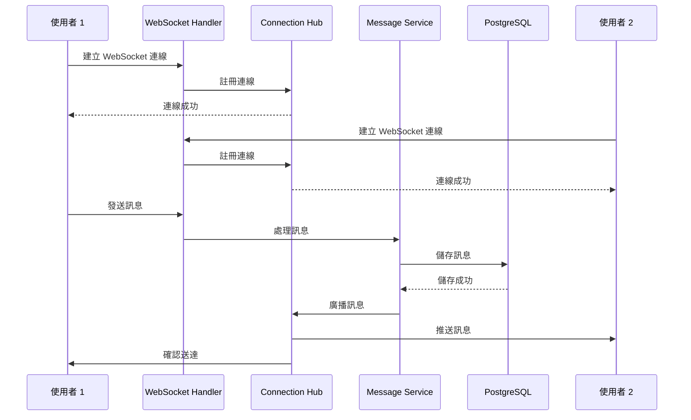
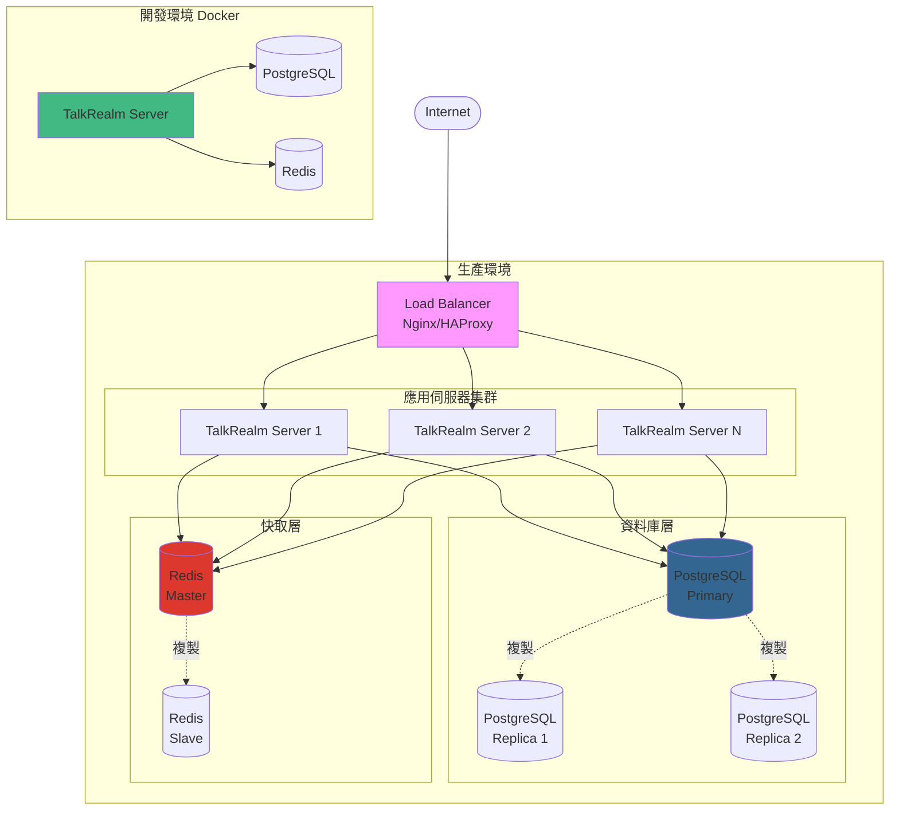
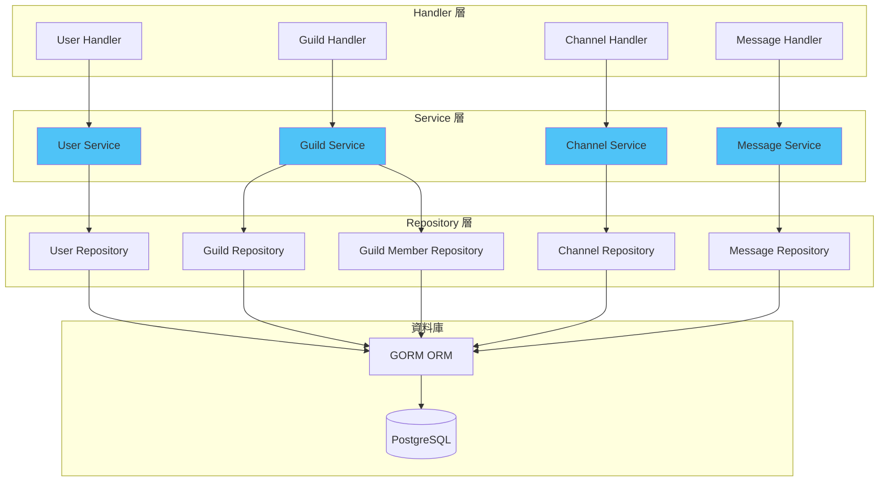
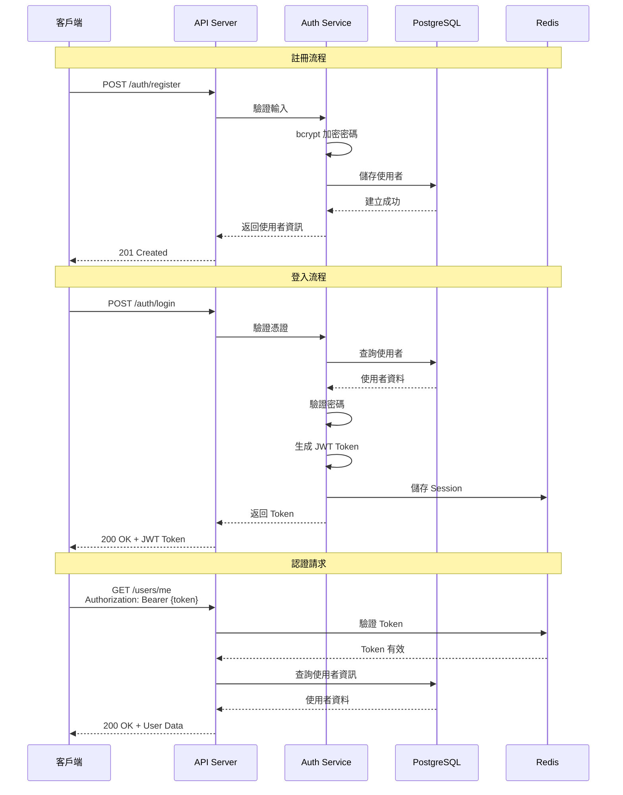
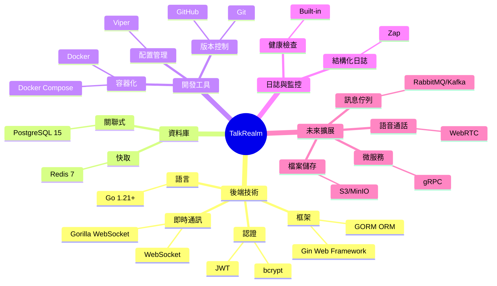

# TalkRealm 系統設計圖

## 系統架構圖

```mermaid
graph TB
    subgraph "客戶端層"
        WebClient[Web 瀏覽器]
        MobileApp[移動應用]
        DesktopApp[桌面應用]
    end

    subgraph "API Gateway"
        Gin[Gin Web Framework<br/>Port: 8080]
    end

    subgraph "應用層"
        Handler[Handler Layer<br/>HTTP/WebSocket 處理]
        Middleware[Middleware<br/>認證/日誌/CORS]
        Service[Service Layer<br/>業務邏輯]
    end

    subgraph "資料層"
        Repository[Repository Layer<br/>資料存取介面]
    end

    subgraph "基礎設施"
        PostgreSQL[(PostgreSQL<br/>主資料庫<br/>Port: 5432)]
        Redis[(Redis<br/>快取/Session<br/>Port: 6379)]
    end

    subgraph "外部服務"
        WebRTC[WebRTC Server<br/>語音通話]
        FileStorage[檔案儲存<br/>圖片/附件]
    end

    WebClient -->|HTTP/WS| Gin
    MobileApp -->|HTTP/WS| Gin
    DesktopApp -->|HTTP/WS| Gin
    
    Gin --> Middleware
    Middleware --> Handler
    Handler --> Service
    Service --> Repository
    
    Repository -->|GORM| PostgreSQL
    Service -->|快取| Redis
    
    Handler -.->|語音| WebRTC
    Service -.->|上傳| FileStorage

    style Gin fill:#42b983
    style PostgreSQL fill:#336791
    style Redis fill:#dc382d
    style WebRTC fill:#ff6b6b
```

## 資料模型關係圖

```mermaid
erDiagram
    User ||--o{ Guild : "owns"
    User ||--o{ GuildMember : "joins"
    User ||--o{ Message : "sends"
    
    Guild ||--o{ Channel : "contains"
    Guild ||--o{ GuildMember : "has"
    
    Channel ||--o{ Message : "stores"
    
    GuildMember }o--|| User : "references"
    GuildMember }o--|| Guild : "belongs to"
    
    Message }o--|| User : "authored by"
    Message }o--|| Channel : "posted in"

    User {
        uint id PK
        string username UK
        string email UK
        string password
        string nickname
        string avatar
        string status
        timestamp created_at
        timestamp updated_at
    }

    Guild {
        uint id PK
        string name
        string description
        string icon
        uint owner_id FK
        timestamp created_at
        timestamp updated_at
    }

    Channel {
        uint id PK
        uint guild_id FK
        string name
        string type
        string topic
        int position
        timestamp created_at
        timestamp updated_at
    }

    Message {
        uint id PK
        uint channel_id FK
        uint user_id FK
        string content
        string type
        timestamp created_at
        timestamp updated_at
    }

    GuildMember {
        uint id PK
        uint guild_id FK
        uint user_id FK
        string nickname
        string role
        timestamp joined_at
        timestamp created_at
        timestamp updated_at
    }
```

## API 請求流程圖

```mermaid
sequenceDiagram
    participant Client as 客戶端
    participant Gin as Gin Router
    participant MW as Middleware
    participant Handler as Handler
    participant Service as Service
    participant Repo as Repository
    participant DB as PostgreSQL
    participant Cache as Redis

    Client->>Gin: HTTP Request
    Gin->>MW: 路由匹配
    
    alt 需要認證
        MW->>Cache: 驗證 JWT Token
        Cache-->>MW: Token 有效
    end
    
    MW->>Handler: 請求處理
    Handler->>Service: 業務邏輯調用
    
    Service->>Cache: 檢查快取
    alt 快取命中
        Cache-->>Service: 返回快取資料
    else 快取未命中
        Service->>Repo: 查詢資料
        Repo->>DB: SQL Query
        DB-->>Repo: 查詢結果
        Repo-->>Service: 資料物件
        Service->>Cache: 更新快取
    end
    
    Service-->>Handler: 處理結果
    Handler-->>Gin: HTTP Response
    Gin-->>Client: JSON Response
```

## WebSocket 即時通訊流程

```mermaid
sequenceDiagram
    participant U1 as 使用者 1
    participant WS as WebSocket Handler
    participant Hub as Connection Hub
    participant Service as Message Service
    participant DB as PostgreSQL
    participant U2 as 使用者 2

    U1->>WS: 建立 WebSocket 連線
    WS->>Hub: 註冊連線
    Hub-->>U1: 連線成功

    U2->>WS: 建立 WebSocket 連線
    WS->>Hub: 註冊連線
    Hub-->>U2: 連線成功

    U1->>WS: 發送訊息
    WS->>Service: 處理訊息
    Service->>DB: 儲存訊息
    DB-->>Service: 儲存成功
    
    Service->>Hub: 廣播訊息
    Hub->>U2: 推送訊息
    Hub->>U1: 確認送達
```

## 部署架構圖

```mermaid
graph TB
    subgraph "生產環境"
        subgraph "應用伺服器集群"
            App1[TalkRealm Server 1]
            App2[TalkRealm Server 2]
            App3[TalkRealm Server N]
        end

        subgraph "資料庫層"
            PG_Primary[(PostgreSQL<br/>Primary)]
            PG_Replica1[(PostgreSQL<br/>Replica 1)]
            PG_Replica2[(PostgreSQL<br/>Replica 2)]
        end

        subgraph "快取層"
            Redis_Master[(Redis<br/>Master)]
            Redis_Slave[(Redis<br/>Slave)]
        end

        LB[Load Balancer<br/>Nginx/HAProxy]
    end

    subgraph "開發環境 Docker"
        Dev[TalkRealm Server]
        DevPG[(PostgreSQL)]
        DevRedis[(Redis)]
    end

    Internet([Internet]) --> LB
    LB --> App1
    LB --> App2
    LB --> App3

    App1 --> Redis_Master
    App2 --> Redis_Master
    App3 --> Redis_Master
    Redis_Master -.複製.-> Redis_Slave

    App1 --> PG_Primary
    App2 --> PG_Primary
    App3 --> PG_Primary
    PG_Primary -.複製.-> PG_Replica1
    PG_Primary -.複製.-> PG_Replica2

    Dev --> DevPG
    Dev --> DevRedis

    style LB fill:#f9f
    style PG_Primary fill:#336791
    style Redis_Master fill:#dc382d
    style Dev fill:#42b983
```

## Repository 模式架構

```mermaid
graph TB
    subgraph "Handler 層"
        UserHandler[User Handler]
        GuildHandler[Guild Handler]
        ChannelHandler[Channel Handler]
        MessageHandler[Message Handler]
    end

    subgraph "Service 層"
        UserService[User Service]
        GuildService[Guild Service]
        ChannelService[Channel Service]
        MessageService[Message Service]
    end

    subgraph "Repository 層"
        UserRepo[User Repository]
        GuildRepo[Guild Repository]
        ChannelRepo[Channel Repository]
        MessageRepo[Message Repository]
        MemberRepo[Guild Member Repository]
    end

    subgraph "資料庫"
        GORM[GORM ORM]
        PG[(PostgreSQL)]
    end

    UserHandler --> UserService
    GuildHandler --> GuildService
    ChannelHandler --> ChannelService
    MessageHandler --> MessageService

    UserService --> UserRepo
    GuildService --> GuildRepo
    GuildService --> MemberRepo
    ChannelService --> ChannelRepo
    MessageService --> MessageRepo

    UserRepo --> GORM
    GuildRepo --> GORM
    ChannelRepo --> GORM
    MessageRepo --> GORM
    MemberRepo --> GORM

    GORM --> PG

    style UserService fill:#4fc3f7
    style GuildService fill:#4fc3f7
    style ChannelService fill:#4fc3f7
    style MessageService fill:#4fc3f7
```

## 專案目錄結構圖

```mermaid
graph TB
    Root[TalkRealm/]
    
    Root --> cmd[cmd/]
    Root --> internal[internal/]
    Root --> pkg[pkg/]
    Root --> api[api/]
    Root --> configs[configs/]
    Root --> scripts[scripts/]
    Root --> docs[docs/]
    Root --> web[web/]

    cmd --> server[server/<br/>main.go]

    internal --> handler[handler/<br/>HTTP 處理器]
    internal --> service[service/<br/>業務邏輯]
    internal --> repository[repository/<br/>資料存取]
    internal --> model[model/<br/>資料模型]
    internal --> middleware[middleware/<br/>中介軟體]
    internal --> iserver[server/<br/>路由設定]

    pkg --> config[config/<br/>配置管理]
    pkg --> logger[logger/<br/>日誌工具]
    pkg --> database[database/<br/>資料庫連線]

    api --> openapi[OpenAPI/<br/>API 文件]

    configs --> yaml[*.yaml<br/>配置檔案]

    scripts --> migrate[migrate.go<br/>資料庫遷移]
    scripts --> docker[docker-*.ps1/sh<br/>Docker 腳本]

    docs --> dbdoc[database.md]
    docs --> dockerdoc[docker.md]

    style Root fill:#ffd700
    style cmd fill:#90ee90
    style internal fill:#87ceeb
    style pkg fill:#ffb6c1
```

## 認證與授權流程（待實作）

```mermaid
sequenceDiagram
    participant Client as 客戶端
    participant API as API Server
    participant Auth as Auth Service
    participant DB as PostgreSQL
    participant Cache as Redis

    Note over Client,Cache: 註冊流程
    Client->>API: POST /auth/register
    API->>Auth: 驗證輸入
    Auth->>Auth: bcrypt 加密密碼
    Auth->>DB: 儲存使用者
    DB-->>Auth: 建立成功
    Auth-->>API: 返回使用者資訊
    API-->>Client: 201 Created

    Note over Client,Cache: 登入流程
    Client->>API: POST /auth/login
    API->>Auth: 驗證憑證
    Auth->>DB: 查詢使用者
    DB-->>Auth: 使用者資料
    Auth->>Auth: 驗證密碼
    Auth->>Auth: 生成 JWT Token
    Auth->>Cache: 儲存 Session
    Auth-->>API: 返回 Token
    API-->>Client: 200 OK + JWT Token

    Note over Client,Cache: 認證請求
    Client->>API: GET /users/me<br/>Authorization: Bearer {token}
    API->>Cache: 驗證 Token
    Cache-->>API: Token 有效
    API->>DB: 查詢使用者資訊
    DB-->>API: 使用者資料
    API-->>Client: 200 OK + User Data
```

## 技術棧總覽

```mermaid
mindmap
  root((TalkRealm))
    後端技術
      語言
        Go 1.21+
      框架
        Gin Web Framework
        GORM ORM
      認證
        JWT
        bcrypt
      即時通訊
        WebSocket
        Gorilla WebSocket
    資料庫
      關聯式
        PostgreSQL 15
      快取
        Redis 7
    開發工具
      版本控制
        Git
        GitHub
      容器化
        Docker
        Docker Compose
      配置管理
        Viper
    日誌與監控
      結構化日誌
        Zap
      健康檢查
        Built-in
    未來擴展
      語音通話
        WebRTC
      檔案儲存
        S3/MinIO
      訊息佇列
        RabbitMQ/Kafka
      微服務
        gRPC
```
