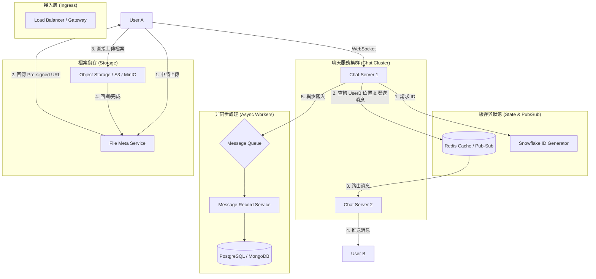

```mermaid
graph TD
    %% 用戶端
    UserA[User A]
    UserB[User B]

    subgraph "接入層 (Ingress)"
        LB[Load Balancer / Gateway]
    end

    subgraph "聊天服務集群 (Chat Cluster)"
        S1[Chat Server 1]
        S2[Chat Server 2]
    end

    subgraph "緩存與狀態 (State & Pub/Sub)"
        Redis[(Redis Cache / Pub-Sub)]
        IDGen[Snowflake ID Generator]
    end

    subgraph "非同步處理 (Async Workers)"
        MQ{Message Queue}
        RecordSvc[Message Record Service]
        DB[(PostgreSQL / MongoDB)]
    end

    subgraph "檔案儲存 (Storage)"
        FileSvc[File Meta Service]
        S3[Object Storage / S3 / MinIO]
    end

    %% 訊息流向
    UserA -- WebSocket --> S1
    S1 -- 1. 請求 ID --> IDGen
    S1 -- 2. 查詢 UserB 位置 & 發送消息 --> Redis
    Redis -- 3. 路由消息 --> S2
    S2 -- 4. 推送消息 --> UserB

    %% 持久化流向
    S1 -- 5. 異步寫入 --> MQ
    MQ --> RecordSvc
    RecordSvc --> DB

    %% 檔案上傳優化流向
    UserA -- 1. 申請上傳 --> FileSvc
    FileSvc -- 2. 回傳 Pre-signed URL --> UserA
    UserA -- 3. 直接上傳檔案 --> S3
    S3 -- 4. 回調/完成 --> FileSvc
```